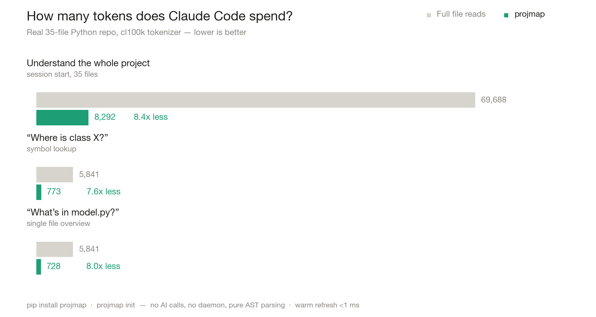
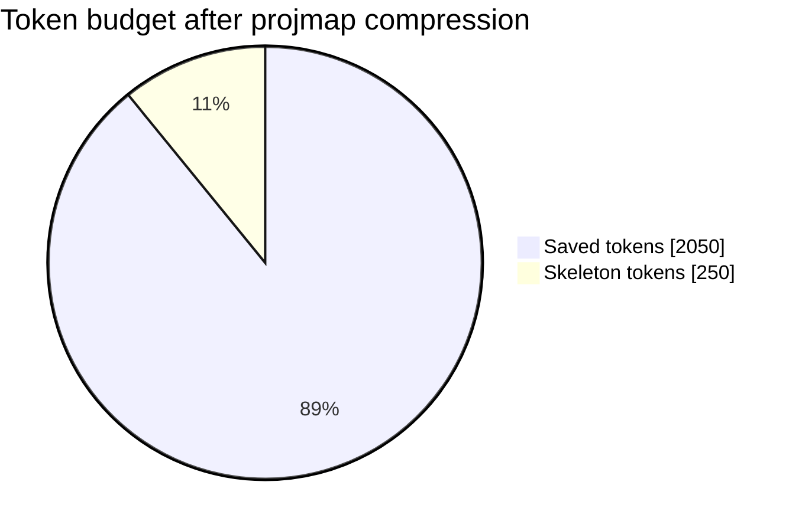
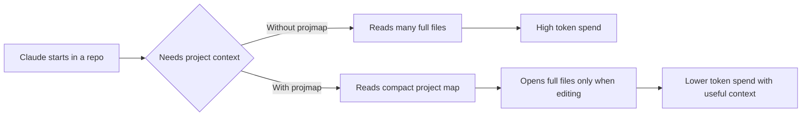

# projmap

[](https://github.com/ZiyoVer/projmap/actions/workflows/ci.yml)
[](https://pypi.org/project/projmap/)
[](https://pypi.org/project/projmap/)
[](LICENSE)

**Zero-config project memory for Claude Code. Cut token usage 5-10x without losing quality. Python + JS/TS.**

Claude Code reads your files to understand your project — and on every session, that "understanding" phase burns through your usage limits. `projmap` gives Claude a compressed, always-fresh map of your codebase instead: function signatures, docstrings, routes, and constants, without the function bodies. Claude only opens a full file when it actually needs to edit it.

<p align="center">
  
</p>

```
Full file read:      ~2,300 tokens
projmap skeleton:      ~250 tokens   (~9x compression on production code)
```

## Token savings at a glance

These numbers use the example above as a simple baseline. Real savings depend on
file size, docstrings, and how often Claude needs to open full files for edits.

| Metric | Full file read | `projmap` skeleton | Difference |
|--------|---------------:|-------------------:|-----------:|
| Tokens per understanding pass | ~2,300 | ~250 | ~2,050 saved |
| Token reduction | 100% | ~11% of original | ~89% less |
| Compression ratio | 1x | ~9.2x smaller | ~8.2x gain |

```mermaid
xychart-beta
    title "Estimated tokens by project scan size"
    x-axis ["1 file", "10 files", "25 files", "50 files"]
    y-axis "Tokens" 0 --> 120000
    bar "Full reads" [2300, 23000, 57500, 115000]
    bar "projmap skeletons" [250, 2500, 6250, 12500]
```





| Scan size | Full reads | With `projmap` | Estimated saved |
|-----------|-----------:|---------------:|----------------:|
| 1 file | ~2,300 | ~250 | ~2,050 |
| 10 files | ~23,000 | ~2,500 | ~20,500 |
| 25 files | ~57,500 | ~6,250 | ~51,250 |
| 50 files | ~115,000 | ~12,500 | ~102,500 |



## Install

```bash
pip install projmap
cd your-repo
projmap init
```

That's it. Start `claude` in the repo — everything is wired automatically.

## What `projmap init` does

One command, three changes, all idempotent and reversible:

1. **`.mcp.json`** — registers the projmap MCP server (existing servers untouched)
2. **`CLAUDE.md`** — appends context rules so Claude uses the map instead of opening files
3. **`.gitignore`** — adds the cache file

No daemon, no background process, no API key. The map refreshes lazily: on every tool call, file hashes are checked and only changed files are re-parsed (milliseconds).

## Tools Claude gets

| Tool | What it does |
|------|--------------|
| `projmap_get_map` | Compressed map of the whole project |
| `projmap_file_skeleton` | Skeleton of a single file (signatures + docstrings) |
| `projmap_find_symbol` | "Where is function X?" — answered with `path:line`, no files opened |

## Other commands

```bash
projmap status        # check setup and index state
projmap map           # print the map to stdout (pipe it anywhere)
projmap find <name>   # find a symbol from the terminal -> path:line
projmap uninstall     # clean removal of all changes
```

`projmap map` makes the tool useful beyond Claude Code: pipe the map into any
LLM, paste it into a PR description, or grep it.

## How it works

Pure Python `ast` parsing for Python and a conservative line-based extractor for JS/TS — no AI calls, no network, no cost. The extractor keeps:

- module docstrings and imports
- `UPPERCASE` constants with values
- class definitions (with docstring summaries) and annotated fields — great for Pydantic models
- **full** function/method signatures: type annotations, default values, `*args/**kwargs`, return types, decorators (FastAPI routes stay visible)
- first line of every docstring
- for JS/TS: imports, exported functions, arrow functions, classes and methods, interfaces, types, enums

Everything else — function bodies — is dropped. That's where the compression comes from, and why quality doesn't suffer: signatures and docstrings are what Claude needs for *navigation and planning*; bodies are only needed for *editing*, and Claude still opens the real file for that.

## Performance

Measured on a real 35-file Python repo with the `cl100k` tokenizer (chart above): understanding
the whole project drops from ~70k to ~8k tokens, and typical "where is X?" /
"what's in this file?" questions are answered for ~700-800 tokens instead of
opening 5-6k-token files.

The index refreshes lazily on every tool call. Files are `stat()`'d and only re-parsed when mtime/size changed — unchanged files are never even opened. Vendored directories (`node_modules`, `.venv`, `build`, …) are pruned before traversal, and minified bundles are skipped.

Measured on a real ~100 KB Python repo (23 files, M-series Mac):

| Operation | Time |
|-----------|-----:|
| Cold index (first call) | ~30 ms |
| Warm refresh (every later call) | <1 ms |

## Stack it: input + output savings

projmap compresses what Claude **reads** (input tokens). Tools like
[caveman](https://github.com/JuliusBrussee/caveman) compress what Claude
**writes** (output tokens) — the two are complementary, and in a typical
coding session input is by far the bigger share.

Want both in one shot? Add output-brevity rules during setup:

```bash
projmap init --concise
```

This appends a short, original "answer with minimum words" section to
CLAUDE.md alongside the projmap rules (and `projmap uninstall` removes it
cleanly). For the full caveman experience — benchmarks, multi-agent support,
the whole 🪨 vibe — install [caveman](https://github.com/JuliusBrussee/caveman)
itself; it works great alongside projmap.

## Honest limitations

- **Python is first-class; JS/TS support is beta** (regex-based — top-level symbols and class methods; deeply nested or unusual syntax may be missed). Tree-sitter is planned for exact parsing.
- Savings apply to the *understanding* phase. When editing, Claude reads the full file — that's correct behavior, not a bug.
- Compression ratio depends on your code: docstring-rich production code compresses 6-12x; thin stub code closer to 2x.
- Write docstrings. The map is only as informative as your first docstring lines.

## Requirements

- Python >= 3.10
- Claude Code with MCP support

## License

MIT (c) O'ktam Ziyodullayev / LangForge AI Technologies
